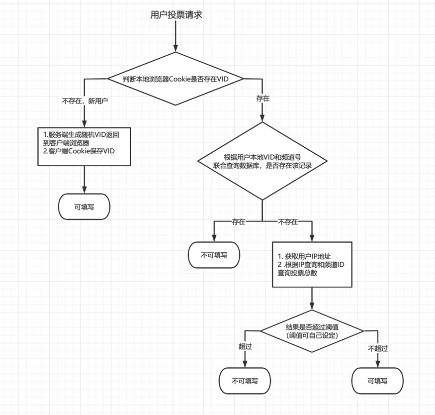

# SimpleVotingSystem

2021-NJUPT的软件实践项目。

后端主要采用Java语言开发。
- 前端主要采用了Jquery库，风格取自Materialize风格。
- 后端方面：
  - 脚手架：Spring Boot
  - 权限控制：Spring Security
  - 渲染引擎：Thymleaf
  - 持久层：Spring JPA
  - 数据库：Mysql
  - 缓存数据库: Redis

项目已部署，部署网站 ：http://81.68.239.206:8081/

项目是采用无登陆方式的匿名投票流程。

验证用户是否具有投票权具体验证流程如下：

具体软件说明书请查看报告或者设计说明书。